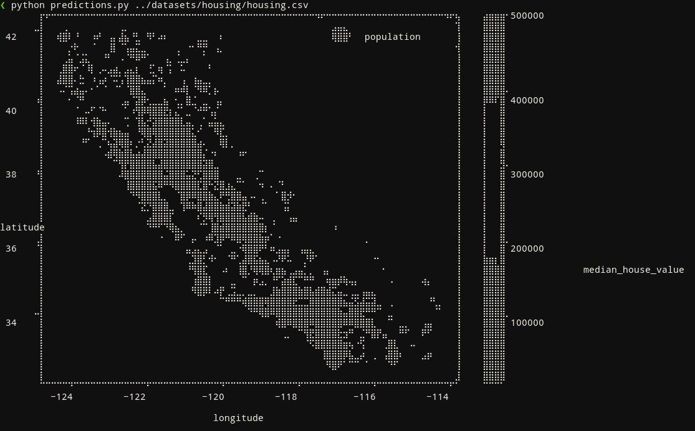

## Hands-On Machine Learning with Scikit-Learn and Tensorflow First Edition by Aurelien Geron

My approach on **hands-on machine learning with scikit-learn and tensorflow first edition by aurelian geron**.

To check if the module already installed (in a terminal):
```
python -c 'import module_name'
```
or
```
python -c 'from module_name import function_name'
```

<details><summary>Example of matplotlib in a terminal (expand)</summary>

</details>

### References
- [View tabular file from terminal](https://stackoverflow.com/questions/1875305/view-tabular-file-such-as-csv-from-command-line).
- [Tabview](https://github.com/TabViewer/tabview).
- [Visidata: Terminal-based multitool for tabular data](https://www.visidata.org/).
- [Sc-im: Terminal-based spreadsheet](https://github.com/andmarti1424/sc-im).
- [Matplotlib terminal](https://github.com/matrach/matplotlib-terminal).
- [Drawille plot](https://github.com/gooofy/drawilleplot).
- [Jupyterlab vim extension for V2](https://github.com/jwkvam/jupyterlab-vim/pull/123).
- [AWS CLI Command](https://docs.aws.amazon.com/cli/latest/reference/s3/cp.html).
- [AWS Open Datasets](https://registry.opendata.aws/).
- [Hash for consistent train-test set](https://stackoverflow.com/questions/58639969/what-is-the-meaning-of-taking-hash-for-consistent-train-test-set).
- [Another test set with hash](https://github.com/ageron/handson-ml/issues/71#issuecomment-323021995).
